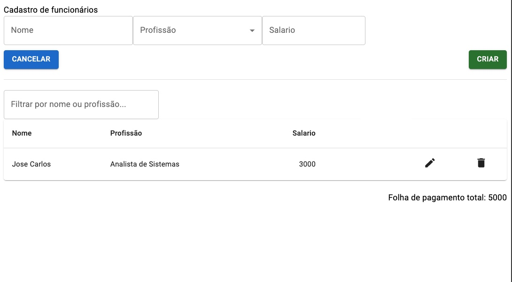

# Specs:

Desenvolver uma tela de CRUD de funcionarios.

## Detalhes:

- O usuário pode criar o registro preenchendo o formulario e clicando em "Criar".
- Na tabela, ele poderá clicar no icone de lápis para edita-lo
- Na tabela, ele poderá clicar no icone da lixeira para deletar (Mostrar Dialog de confirmação)
- No topo superior esquerdo (Embaixo do formulario) temos o botão "Cancelar"... Clicar no botão "Cancelar" faz com que limpe o formulário para permitir criar um novo.
    - OBS: Botão chamara "Criar" quando estiver criando, e "Atualizar" quando estiver editando
- No campo de filtragem será possível filtrar por nome ou profissão. O estilo de filtragem é um "contains" (EX: LIKE '%jose%') e deve ser case-insensitive.
-  Na parte inferior da tabela mostrar o salario total com base no filtro. Ou seja, se eu pesquisar por "Jose" irá mostrar a soma total da folha de pagamento de todos "Joses". Limpar o filtro mostrara todos resultados e por consequencia a folha de pagamento de todos.

### Estrutura da entidade

O "funcionario" tera:
- Nome (Tipo texto)
- Profissão (Tipo Enum - Opcões: Desenvolvedor Back-end, Desenvolvedor Front-end, Desenvolvedor Mobile, Desenvolvedor Full-stack)
- Salario (Tipo numerico)

